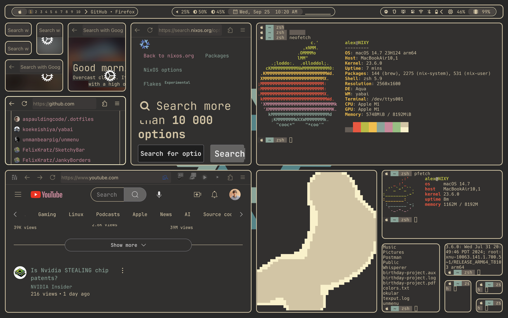

# .dotfiles
A Universal .dotfiles Configuration with Nix Flakes - over-engineered by Alex Spaulding.

## How much code?
👨‍💻 There are 1,268,774 lines of code in this repo. Last updated: Fri May  9 13:20:50 2025

## Getting Started
This repo contains my ___nixified___ .dotfiles, which additionally defines the operating system environment for NixOS and Darwin.
__Note:__ this repo was not designed to be installed for other interested users.

### FRESH INSTALL
Please [read the Notes](https://github.com/aspauldingcode/.dotfiles/issues/158) for info on what to do for a fresh install.

# I'm being productive, I swear!
