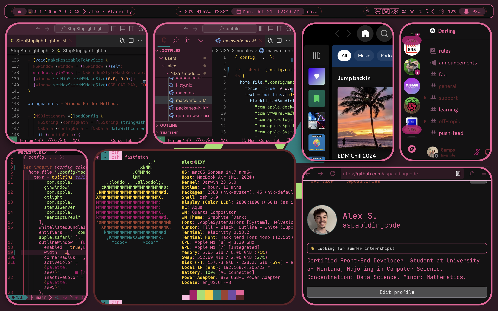

# .dotfiles

A Universal .dotfiles Configuration with Nix Flakes - over-engineered by Alex
Spaulding.

<!-- BEGIN CODE STATS -->
## How much code?

👨‍💻 Code Statistics:

_Total LOC (including blanks, comments): **31274**_

<details>
<summary>🔍 Click to expand code stats.</summary>

| Language   | Files | Lines | Code  | Comments | Blanks |
|------------|-------|-------|-------|----------|--------|
| CSS | 4 | 1882 | 1416 | 124 | 342 |
| JSON | 1 | 448 | 448 | 0 | 0 |
| Lua | 1 | 225 | 138 | 50 | 37 |
| Markdown | 1 | 100 | 0 | 73 | 27 |
| Nix | 141 | 25562 | 21225 | 2592 | 1745 |
| Python | 10 | 2066 | 1747 | 93 | 226 |
| Shell | 6 | 154 | 102 | 25 | 27 |
| Plain Text | 2 | 562 | 0 | 371 | 191 |
| TOML | 1 | 56 | 47 | 5 | 4 |
| Vim script | 0 | 0 |  |  |  |
| YAML | 3 | 219 | 64 | 111 | 44 |
| **Total**  | 170 | 31274 | 25187 | 3444 | 2643 |

</details>

Last updated: Thu Jun 26 10:50:36 PDT 2025
<!-- END CODE STATS -->

## 📦 Flake Configuration Overview

### 🖥️ System Configurations

- **NIXY** (macOS/Darwin - aarch64): Main macOS development machine
- **NIXY2** (NixOS - aarch64): Asahi Linux on NIXY M1 MBA (dual-boot)
- **NIXSTATION64** (NixOS - x86_64): Desktop Linux workstation
- **NIXEDUP** (NixOS - aarch64): Mobile NixOS (experimental)

### 🚀 Quick Start App

Run the system installer with:

```bash
nix run github:aspauldingcode/.dotfiles
```

_System configuration installer [TUI] - sets up dotfiles, and all prerequisites_

### 📋 Available Flake Outputs

```bash
# View all available outputs
nix flake show github:aspauldingcode/.dotfiles

# Build configurations after installing
rebuild

# Enter development shell
nix develop
```

### 🔧 Key Features

- **Universal Configuration**: Works across macOS (Darwin) and NixOS
- **Sops-nix Integration**: Encrypted secrets management
- **Home Manager**: User environment management
- **Nix-Colors**: System-wide theming with Nix-Colors variables
- **Custom Overlays**: NUR, unstable packages, and custom derivations
- **Development Shells**: Pre-configured development environments
- **Modular Design**: Organized system and user configurations

### 📁 Structure

```
.dotfiles/
├── flake.nix           # Main flake configuration
├── system/             # System-level configurations
│   ├── NIXY/          # macOS configuration
│   ├── NIXSTATION64/  # x86_64 NixOS config
│   ├── NIXEDUP/       # aarch64 NixOS config
│   └── NIXY2/         # Secondary aarch64 NixOS config
├── users/             # User-specific configurations
│   └── alex/          # User configurations per system
├── sops-nix/          # Encrypted secrets
├── shared/            # Shared modules across all systems
│   └── scripts/       # Shared scripts (tokei, toggle-scripts, etc.)
└── README.md          # This file
```

## Getting Started

This repo contains my **_nixified_** .dotfiles, which additionally defines the
operating system environment for NixOS and Darwin. **Note:** this repo is
currently not designed to be installed for other interested users.

### FRESH INSTALL

Please [read the Notes](https://github.com/aspauldingcode/.dotfiles/issues/158)
for info on what to do for a fresh install.

# I'm being productive, I swear


