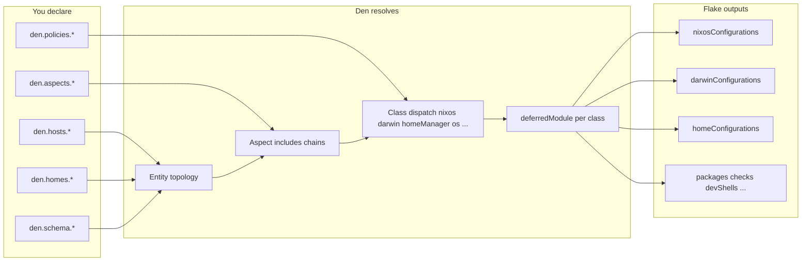

# Den — Deep Reference

[Den](https://github.com/denful/den) is an **aspect-oriented, context-driven** framework for Nix configurations. It sits on top of the [Dendritic Pattern](./dendritic-patterns.md) and takes feature organization from the **file level** to the **function level**: aspects are reusable bundles that produce the right modules for NixOS, nix-darwin, Home Manager, and custom classes depending on _where_ they are applied (host, user, home, fleet, …).

Official upstream docs: [den.denful.dev](https://den.denful.dev)

This document explains Den in depth and documents **how this repository uses it**.

---

## Table of contents

1. [Why Den exists](#why-den-exists)
2. [Mental model](#mental-model)
3. [Core vocabulary](#core-vocabulary)
4. [The context pipeline](#the-context-pipeline)
5. [Entities: hosts, users, homes](#entities-hosts-users-homes)
6. [Aspects](#aspects)
7. [Nix classes](#nix-classes)
8. [Custom classes and forwarding](#custom-classes-and-forwarding)
9. [Schema](#schema)
10. [Policies](#policies)
11. [Batteries](#batteries)
12. [Flake integration](#flake-integration)
13. [den.lib API surface](#denlib-api-surface)
14. [This repository’s Den layout](#this-repositorys-den-layout)
15. [Patterns and recipes](#patterns-and-recipes)
16. [Pitfalls and debugging](#pitfalls-and-debugging)
17. [Further reading](#further-reading)

---

## Why Den exists

The Dendritic Pattern solves **feature locality**: Brave, Neovim, and theming live in one file each, exporting `flake.modules.*` for every class they touch.

Den solves the **next layer of complexity**:

| Problem                                                  | Dendritic alone                                       | With Den                                               |
| -------------------------------------------------------- | ----------------------------------------------------- | ------------------------------------------------------ |
| Declaring `nixosConfigurations` / `darwinConfigurations` | Hand-written in `flake.nix` or a `configurations.nix` | `den.hosts.*` → auto-generated flake outputs           |
| Same feature on laptop + server + Mac                    | Import merged modules in each host file               | `den.aspects.workstation` + `includes` on host aspects |
| NixOS + Darwin share 90% of system config                | Duplicate bodies or heavy `mkIf`                      | Custom class `os` forwards once to both                |
| User config depends on which host they’re on             | `specialArgs` + conditionals everywhere               | Parametric aspects `{ host, user }: …`                 |
| Standalone HM vs embedded HM                             | Separate wiring                                       | `den.homes.*` + policies unify topology                |

Den’s tagline: **parametric configurations at the function level**. An aspect is not just a static module — it can be a function of context (`host`, `user`, `home`, …) that emits different Nix modules per class.

Den has **zero runtime dependencies** outside Nix itself. `den.lib` is domain-agnostic; the OS framework (NixOS / nix-darwin / HM) is optional layers you opt into.

---

## Mental model

Think of Den as a **declarative data transformation pipeline**:



**You declare topology and features.** Den walks entities (hosts → users → homes), resolves aspect trees, dispatches class keys (`nixos`, `darwin`, `homeManager`, `os`, …), and produces merged modules. Host/home **instantiation** (`lib.nixosSystem`, `lib.darwinSystem`, `homeManagerConfiguration`) happens via policies at the end of the pipeline.

---

## Core vocabulary

| Term           | Meaning                                                                                                                                     |
| -------------- | ------------------------------------------------------------------------------------------------------------------------------------------- |
| **Entity**     | A named thing in your infra: host, user (on a host), standalone home, fleet, …                                                              |
| **Aspect**     | A named configuration bundle under `den.aspects.<name>`. Can be an attrset of class modules or a function `{ host, ... }: { nixos = ...; }` |
| **Class**      | A Nix module “channel”: `nixos`, `darwin`, `homeManager`, `user`, `os`, `packages`, …                                                       |
| **Include**    | Aspect composition: `includes = [ otherAspect den.batteries.foo ]` merges another aspect’s resolution into this one                         |
| **Policy**     | Directed edge in the pipeline: “when host X is resolved, also instantiate flake output” or “route `os` class into `nixos`”                  |
| **Schema**     | Base deferred modules per entity kind (`den.schema.host`, `den.schema.user`, …) — typed fields, defaults, shared includes                   |
| **Battery**    | Reusable aspect or helper shipped with Den (`den.batteries.primary-user`, `den.batteries.os-class`, …)                                      |
| **Context**    | The set of entity bindings available during aspect resolution (`host`, `user`, `home`, …)                                                   |
| **Resolved**   | Read-only option on entities: `config.resolved` → fully merged aspect tree for that entity                                                  |
| **mainModule** | Internal: `den.lib.aspects.resolve host.class host.resolved` — the module list passed to `nixosSystem` / `darwinSystem`                     |

### Aspect naming convention

By default, a host named `mba` looks up `den.aspects.mba`:

```nix
# nix/lib/entities/_types.nix (simplified)
lookupAspect = den: config:
  if den.aspects ? ${config.name} then
    den.aspects.${config.name}
  else
    lib.warn "den.aspects.${config.name} not defined — entity gets empty aspect" { };
```

If `den.aspects.mba` is missing, evaluation continues with an **empty aspect** and a warning — not a hard error. You can override `aspect` on the host entry explicitly when names diverge.

---

## The context pipeline

Den resolves aspects through a fixed handler pipeline (`den.lib.aspects.fx.pipeline`). Handlers run in order to:

1. **Establish scope** — push/pop context (`host`, `user`, …)
2. **Process includes** — walk `includes` lists, detect cycles, deduplicate
3. **Compile class bodies** — turn aspect keys into deferred modules
4. **Forward classes** — map custom classes (e.g. `os` → `nixos`)
5. **Dispatch policies** — fire route/instantiate/provide effects
6. **Collect imports** — merge all modules for the requested class

Public resolution entry points (`den.lib.aspects`):

| Function                            | Purpose                                                   |
| ----------------------------------- | --------------------------------------------------------- |
| `resolve class aspectTree`          | Full resolution → single deferred module for `class`      |
| `resolveImports class aspectTree`   | Same but skips entity instantiation (nested extraction)   |
| `resolveWithState class aspectTree` | Full pipeline result including internal state (debugging) |

Manual resolution (outside the flake output pipeline):

```nix
let
  aspect = den.lib.aspects.resolve "nixos"
    (den.aspects.my-aspect { host = den.hosts.x86_64-linux.my-laptop; });
in
lib.nixosSystem { modules = [ aspect ]; }
```

### Parametric vs static aspects

**Static aspect** — plain attrset of class modules:

```nix
den.aspects.igloo = {
  nixos = { pkgs, ... }: { environment.systemPackages = [ pkgs.hello ]; };
  homeManager.programs.direnv.enable = true;
};
```

**Parametric aspect** — function receiving context:

```nix
den.aspects.cooper = { user, ... }: {
  nixos.users.users.${user.userName}.description = "Alice Cooper";
};

den.aspects.setHost = { host, ... }: {
  networking.hostName = host.hostName;
};
```

Parametric aspects only emit configuration when their required context keys are present in the current pipeline scope. That is how user-only or host-only snippets live in shared aspect files without `mkIf` spam.

### `den.default`

Global includes applied to every resolution root (via `resolveEntity` for kind `"default"`):

```nix
# Built into Den — os class routing
den.default.includes = [ den.policies.os-to-host ];
```

Use `den.default.includes` in your flake to inject batteries or policies everywhere.

---

## Entities: hosts, users, homes

### Host declaration

Hosts live under **`den.hosts.<system>.<name>`**:

```nix
den.hosts.aarch64-darwin.mba = {
  instantiate = darwinSystemWithInputs;  # optional override
};
```

Each host entity gets (from `nix/lib/entities/host.nix`):

| Field         | Default                                                           | Role                                    |
| ------------- | ----------------------------------------------------------------- | --------------------------------------- |
| `name`        | attr name (`mba`)                                                 | Logical name                            |
| `hostName`    | same as `name`                                                    | `networking.hostName` unless overridden |
| `system`      | parent key (`aarch64-darwin`)                                     | Platform string                         |
| `class`       | `darwin` if system ends with `-darwin`, else `nixos`              | Which OS module class to resolve        |
| `aspect`      | `den.aspects.<name>`                                              | Aspect tree for this host               |
| `instantiate` | `nixpkgs.lib.nixosSystem` or `darwin.lib.darwinSystem`            | Builder function                        |
| `intoAttr`    | `["nixosConfigurations" name]` or `["darwinConfigurations" name]` | Where to put flake output               |
| `mainModule`  | `resolve class resolved`                                          | Module passed to `instantiate`          |
| `users`       | `{}`                                                              | Users on this host                      |

**Instantiation** (policy `den.lib.policy.instantiate`):

```nix
host.instantiate {
  modules = [ host.mainModule ];
  specialArgs = { ... };  # only if your instantiate wrapper adds them
}
```

The result is stored at `flake.<intoAttr>` — e.g. `flake.darwinConfigurations.mba`.

### Users on hosts

```nix
den.hosts.x86_64-linux.igloo.users.alice = { };
den.hosts.aarch64-darwin.apple.users.alice = { };
```

User entities carry:

- `userName`, `name`, `aspect` (default `den.aspects.<username>`)
- `classes` — home environment classes (default `["user"]`; set `["homeManager"]` to enable HM)
- `host` — back-reference to parent host

Host aspects can push defaults to all users via `provides.to-users`:

```nix
den.aspects.workstation.provides.to-users = {
  homeManager = { pkgs, ... }: {
    programs.vim.enable = true;
  };
};
```

### Standalone homes

```nix
den.homes.aarch64-darwin."vic@mac" = { };
# or
den.homes.x86_64-linux.alice = { };
```

Homes get their own aspect lookup (`den.aspects.<name>`), `intoAttr` defaulting to `homeConfigurations`, and optional binding to a host’s `osConfig` for HM modules that need system context.

This repo’s **`8amps-linux`** HM config is still hand-rolled in `modules/configurations.nix` — a future `den.homes.*` migration would give it the same aspect resolution as embedded users.

---

## Aspects

An aspect is the **unit of reusable configuration**. Structure:

```nix
den.aspects.my-feature = {
  # Composition
  includes = [
    config.den.aspects.styling
    den.batteries.primary-user
    (den.batteries.user-shell "fish")
  ];

  # Class bodies (deferred modules or attrsets)
  nixos  = { pkgs, ... }: { ... };
  darwin = { pkgs, ... }: { ... };
  homeManager = { pkgs, lib, config, ... }: { ... };
  os = { ... }: { ... };  # forwarded to nixos + darwin via policy

  # Sub-aspects (namespaced under this aspect)
  provides.emulation = {
    nixos = { ... }: { ... };
  };

  # Inline policies (cross-scope effects)
  policies.to-igloo = { host, user, ... }:
    lib.optional (host.name == "igloo") (
      den.lib.policy.provide {
        class = "nixos";
        module.programs.nh.enable = true;
      }
    );
};
```

### `includes`

- **Order matters** for merge semantics (later modules override earlier where options allow).
- Can reference other aspects, batteries, inline let-bound aspects, or angle-bracket batteries: `<den/primary-user>`.
- Cycles are detected (`checkDedupHandler` in the pipeline).

### `provides.*`

Nested aspect subtrees. Useful for grouping sub-features:

```nix
den.aspects.gaming.provides.emulation.nixos = { pkgs, ... }: { ... };

# Consumed via:
includes = [ den.aspects.gaming.provides.emulation ];
```

### Class key forms

Den accepts several shapes for class modules:

1. **Submodule function** — `{ pkgs, ... }: { config = ...; }`
2. **Flat attrset** — `homeManager.programs.direnv.enable = true` (shorthand)
3. **Bare deferred module** — passed directly as aspect value in advanced cases

Flat form is sugar; the pipeline normalizes to deferred modules.

### Collision policy

When Den context args (`host`, `user`) collide with normal module args in flat class modules:

```nix
den.config.classModuleCollisionPolicy = "error";  # default
# or "class-wins" | "den-wins"

# Per-entity override:
den.schema.host.collisionPolicy = "den-wins";
```

---

## Nix classes

Classes are keys on aspects that dispatch to module types. Built-in OS classes:

| Class         | Description                                        |
| ------------- | -------------------------------------------------- |
| `nixos`       | NixOS system module                                |
| `darwin`      | nix-darwin system module                           |
| `homeManager` | Home Manager module                                |
| `user`        | Forwards into `{nixos\|darwin}.users.users.<name>` |

Flake output classes (when using flake-parts integration):

| Class                                                       | Routes to                           |
| ----------------------------------------------------------- | ----------------------------------- |
| `packages`, `apps`, `checks`, `devShells`, `legacyPackages` | `flake.<output>.<system>`           |
| `flake`, `flake-parts`                                      | Top-level flake / perSystem modules |

Aspects can **register new classes**:

```nix
den.aspects.my-stuff.classes.hjem = {
  description = "Home Manager alternative";
};
```

Registered classes merge into `den.classes` via `modules/aspect-schema.nix`.

---

## Custom classes and forwarding

### The `os` class (built-in battery)

The most important custom class for multi-platform repos. **`os`** means “apply this to both NixOS and nix-darwin”:

```nix
den.aspects.my-host = {
  os.networking.hostName = "foo";
  # equivalent to setting hostName in both nixos and darwin bodies
};
```

Implementation (`modules/aspects/batteries/os-class.nix`):

- Registers `den.classes.os`
- Adds `den.policies.os-to-host` to `den.default.includes`
- Policy routes `fromClass = "os"` → `intoClass = host.class` when class is `nixos` or `darwin`

**This repo uses `os` in `den-aspects/styling.nix`** for shared Stylix + `dendritic.theme.*` options, with `nixos`-only and `darwin`-only extras in sibling keys.

### `den.batteries.forward`

General mechanism for custom classes. Example — platform-specific HM:

```nix
den.aspects.hmPlatforms = { class, aspect-chain }: den.batteries.forward {
  each = [ "Linux" "Darwin" ];
  fromClass = platform: "hm${platform}";
  intoClass = _: "homeManager";
  intoPath = _: [ ];
  fromAspect = _: lib.head aspect-chain;
  guard = { pkgs, ... }: platform: lib.mkIf pkgs.stdenv."is${platform}";
  adaptArgs = { config, ... }: { osConfig = config; };
};

den.aspects.tux = {
  includes = [ den.aspects.hmPlatforms ];
  hmDarwin = { pkgs, ... }: { home.packages = [ pkgs.iterm2 ]; };
  hmLinux  = { pkgs, ... }: { home.packages = [ pkgs.wl-clipboard-rs ]; };
};
```

Parameters:

| Param        | Role                                                               |
| ------------ | ------------------------------------------------------------------ |
| `each`       | List of items to iterate                                           |
| `fromClass`  | Source class name(s) on the aspect                                 |
| `intoClass`  | Target class                                                       |
| `intoPath`   | Path within target config (e.g. `[ "environment" "persistence" ]`) |
| `guard`      | Conditional wrapper — only forward when guard returns true         |
| `adaptArgs`  | Inject extra module args (e.g. `osConfig`)                         |
| `fromAspect` | Which aspect node supplies the source modules                      |

Custom classes are how Den implements `user`, `hjem`, `wsl`, `microvm`, and how you can build role-based or capability-based routing.

---

## Schema

`den.schema.<kind>` defines **base deferred modules** for entity kinds:

```nix
den.schema.host = { host, lib, ... }: {
  options.roles = lib.mkOption { type = lib.types.listOf lib.types.str; default = []; };
};

den.schema.user.includes = [ den.batteries.define-user ];

den.schema.user.classes = lib.mkDefault [ "homeManager" ];
```

Default schema kinds: `conf`, `fleet`, `host`, `user`, `home`, `flake`, `flake-system`.

Schema entries support:

- **`includes` / `excludes`** — aspect chains applied to every entity of that kind
- **`collisionPolicy`** — per-kind collision handling
- **Custom options** — become fields on host/user/home records

Entity **`id_hash`**: auto-computed stable identity for comparing entities without fragile `==` on module thunks.

Every entity with structural content gets **`config.resolved`** — the merged aspect tree after includes, used to build `mainModule`.

---

## Policies

Policies declare **directed edges** in the resolution graph. Registry: `den.policies.<name>`.

### Built-in flake policies (`modules/policies/flake.nix`)

```text
flake
  └─ flake-to-systems → one flake-system per system
       ├─ system-to-os-outputs → each host → resolve + instantiate
       └─ system-to-hm-outputs → each home → resolve + instantiate
```

`den.lib.policy.instantiate host` calls:

```nix
host.instantiate { modules = [ host.mainModule ]; }
```

and assigns the result to `config.flake` at `host.intoAttr`.

### Policy helpers

| Helper                                                     | Purpose                                                     |
| ---------------------------------------------------------- | ----------------------------------------------------------- |
| `den.lib.policy.route { fromClass; intoClass; path; ... }` | Route modules from one class to another location            |
| `den.lib.policy.provide { class; module; }`                | Inject a module cross-scope (e.g. user aspect → host nixos) |
| `den.lib.policy.include { ... }`                           | Shorthand include effect                                    |
| `den.lib.policy.instantiate entity`                        | Produce flake configuration output                          |
| `den.lib.policy.resolve.to target ctx`                     | Navigate pipeline to a target kind                          |

### Aspect-local policies

Aspects can define `policies.<name>` as functions `{ host, user, ... }: [ effects ]`:

```nix
den.aspects.alice.policies.to-igloo = { host, user, ... }:
  lib.optional (host.name == "igloo") (
    den.lib.policy.provide {
      class = "nixos";
      module.programs.nh.enable = true;
    }
  );
```

Remember to add `includes = [ den.aspects.alice.policies.to-igloo ]` (or rely on a parent include) so the policy participates in resolution.

---

## Batteries

Batteries are reusable aspects/helpers under `den.batteries.*`:

| Battery                          | Purpose                                                  |
| -------------------------------- | -------------------------------------------------------- |
| `primary-user`                   | Mark user as admin / primary on host                     |
| `define-user`                    | Standard user option schema                              |
| `hostname`                       | Set hostname from entity                                 |
| `user-shell "fish"`              | Parametric default shell                                 |
| `import-tree`                    | Filesystem auto-import into host/user/home schema        |
| `unfree` / `insecure`            | Predicate builders for nixpkgs config                    |
| `vm-autologin` / `tty-autologin` | VM/getty helpers                                         |
| `os-class`                       | The `os` forwarding policy (always on via `den.default`) |

Parametric batteries are functors:

```nix
includes = [
  (den.batteries.user-shell "zsh")
  (den.batteries.unfree [ "vscode" ])
];
```

Angle-bracket syntax resolves batteries from Den’s namespace:

```nix
includes = [ <den/primary-user> ];
```

---

## Flake integration

### Minimal setup (this repo)

**1. Input**

```nix
# flake.nix
inputs.den.url = "github:denful/den";
```

**2. Import flake module**

```nix
# modules/host-topology-den.nix
imports = [
  inputs.den.flakeModule
  ../den-aspects/styling.nix
];
```

`inputs.den.flakeModule` auto-imports all modules under Den’s `modules/` tree (options, policies, batteries, outputs).

**3. Declare hosts and aspects** (see [This repository’s Den layout](#this-repositorys-den-layout)).

### flakeOutputs merge semantics

Den defines `options.flake.nixosConfigurations`, `flake.darwinConfigurations`, `flake.homeConfigurations`, etc. with **lazy attr merge** so multiple modules can contribute.

If you see:

```text
If you see this message it likely means you have more than
one value for a flake output that was expected to be unique.
```

Import the matching output helper:

```nix
imports = [ inputs.den.flakeOutputs.nixosConfigurations ];
```

Or define your own merge strategy on `options.flake.<output>`.

### Without flake-parts

Den works standalone via `imports = [ inputs.den.flakeModule ]` — see `templates/minimal` and `templates/noflake`.

### With flake-parts (this repo)

Your existing `flake-parts.lib.mkFlake` evaluation merges Den’s `systems`, `perSystem`, and `flake` options. Den’s `modules/outputs.nix` resolves `flake-parts` class modules from aspects when `inputs.flake-parts` is present.

### Custom `instantiate` (required here)

Den’s default `darwinSystem` / `nixosSystem` do **not** pass `specialArgs.inputs`. This repo’s host files destructure `inputs` at module top level:

```nix
# hosts/darwin/mba/default.nix
{ inputs, pkgs, lib, ... }: { ... }
```

Fix in `host-topology-den.nix`:

```nix
withInputs = builder: args:
  builder (args // {
    specialArgs = (args.specialArgs or { }) // { inherit inputs; };
  });

den.hosts.aarch64-darwin.mba = {
  instantiate = withInputs inputs.nix-darwin.lib.darwinSystem;
};
```

Any new host that uses `inputs.*` in its module tree needs this wrapper (or an equivalent `specialArgs` injection on the host entity).

---

## den.lib API surface

| Path                             | Role                                     |
| -------------------------------- | ---------------------------------------- |
| `den.lib.aspects.resolve`        | Resolve aspect tree → module for class   |
| `den.lib.aspects.resolveImports` | Resolve without instantiation            |
| `den.lib.aspects.hasAspect`      | Introspection helpers                    |
| `den.lib.resolveEntity kind ctx` | Build resolution root for entity kind    |
| `den.lib.policy.*`               | Policy constructors                      |
| `den.lib.forward`                | Low-level forwarding                     |
| `den.batteries.*`                | Reusable aspects                         |
| `den.systems`                    | List of systems derived from hosts/homes |
| `den.schema.*`                   | Schema modules                           |
| `den.classes.*`                  | Class metadata                           |
| `den.lib.diag.*`                 | Diagram generation (fleet templates)     |
| `den.lib.nh`                     | Nix Helper integration in templates      |

Den also exposes **`den.ful`** (internal namespaces) and **`flake.denful`** for cross-flake aspect sharing via `den.namespace`.

---

## This repository’s Den layout

Den adoption here is **incremental**: host topology + styling aspect use Den fully; feature modules remain primarily **flake-parts dendritic** with optional `den.aspects.*` mirrors.

```text
flake.nix                          den input
modules/host-topology-den.nix      den.flakeModule + all den.hosts / host aspects
den-aspects/styling.nix            den.aspects.styling (os + nixos + darwin + HM)
modules/apps/brave.nix             den.aspects.brave (mirror only)
modules/*.nix                      flake.modules.*.dendritic (primary feature path)
hosts/darwin/mba/default.nix       raw host identity; imported by den.aspects.mba
modules/configurations.nix         HM standalone (not yet den.homes.*)
```

### Host topology

| Host         | System         | Aspect                   | Notes                          |
| ------------ | -------------- | ------------------------ | ------------------------------ |
| `mba`        | aarch64-darwin | `den.aspects.mba`        | Light theme override           |
| `mba-dark`   | aarch64-darwin | `den.aspects.mba-dark`   | Dark theme `mkForce`           |
| `mba-asahi`  | aarch64-linux  | `den.aspects.mba-asahi`  | Apple Silicon NixOS            |
| `nixos-test` | aarch64-linux  | `den.aspects.nixos-test` | Test VM                        |
| `microvm`    | aarch64-linux  | `den.aspects.microvm`    | vfkit guest; inline nixos body |

Each host aspect follows the same pattern:

```nix
den.aspects.mba = {
  includes = [ config.den.aspects.styling ];
  darwin.imports = [
    { nixpkgs.config.allowUnsupportedSystem = true; }
    ../hosts/darwin/mba
    { dendritic.theme.variant = "light"; }
  ];
};
```

- **`includes`** pulls shared Stylix/theming (`os` + HM + per-OS extras).
- **`darwin.imports`** preserves the existing host module verbatim.
- Small inline modules apply host-only overrides (theme variant).

### Styling aspect (`den-aspects/styling.nix`)

| Class         | Content                                                                      |
| ------------- | ---------------------------------------------------------------------------- |
| `os`          | Shared Stylix enable, palette, fonts, wallpaper, `dendritic.theme.*` options |
| `nixos`       | NixOS Stylix module, cursor, opacity, specialisations                        |
| `darwin`      | nix-darwin Stylix module, font packages                                      |
| `homeManager` | Full HM Stylix (Firefox CSS, Ghostty, etc.)                                  |

Dual export to dendritic monolith:

```nix
den.aspects.styling.homeManager = stylingHmModule;
flake.modules.homeManager.dendritic = stylingHmModule;
```

Embedded HM users in host files import `inputs.self.modules.homeManager.dendritic`, so they receive styling **without** `den.homes.*`.

### Brave aspect mirror (`modules/apps/brave.nix`)

```nix
flake.modules.homeManager.dendritic = braveHmModule;
flake.modules.darwin.dendritic = braveDarwinModule;

den.aspects.brave = {
  homeManager = braveHmModule;
  darwin = braveDarwinModule;
};
```

Brave is active today via the **dendritic monolith** path (host imports `inputs.self.modules.*.dendritic`). The Den aspect exists so a host could later do:

```nix
den.aspects.my-host.includes = [ config.den.aspects.brave ];
```

…without touching HM import lists.

### What is _not_ on Den yet

| Area                               | Current state                        | Den target                           |
| ---------------------------------- | ------------------------------------ | ------------------------------------ |
| Feature modules (`modules/apps/*`) | `flake.modules.*.dendritic` only     | Optional `den.aspects.*` per feature |
| Standalone HM `8amps-linux`        | `modules/configurations.nix`         | `den.homes.*`                        |
| User topology                      | Users declared inside host HM blocks | `den.hosts.*.users.*` + user aspects |
| Fleet / policies                   | Unused                               | `den.policies.*`, `den.schema.fleet` |

---

## Patterns and recipes

### Add a new Den-managed host

1. Add host module under `hosts/<class>/<name>/`.
2. In `host-topology-den.nix`:

   ```nix
   den.hosts.aarch64-darwin.my-host = {
     instantiate = darwinSystemWithInputs;
   };

   den.aspects.my-host = {
     includes = [ config.den.aspects.styling ];
     darwin.imports = [ ../hosts/darwin/my-host ];
   };
   ```

3. Switch: `nh darwin switch -H my-host`.

Aspect name must match host name **or** set `aspect` explicitly on the host.

### Share config between NixOS and Darwin once

Use `os` class in an aspect:

```nix
den.aspects.base = {
  os = { pkgs, ... }: {
    environment.systemPackages = [ pkgs.direnv ];
  };
};
```

### Migrate a hand-rolled `flake.nixosConfigurations.foo`

1. Move inline module body into `den.aspects.foo.nixos`.
2. Declare `den.hosts.<system>.foo`.
3. Delete the old `flake.nixosConfigurations.foo` assignment.
4. Run `nix flake check`.

This repo did that for `microvm` (previously in `modules/microvm.nix`).

### Dual-export during migration

Keep `flake.modules.homeManager.dendritic` **and** `den.aspects.feature.homeManager` pointing at the **same** let-bound module. Zero duplication, both consumption paths work.

### Parametric user aspect

```nix
den.aspects.8amps = { user, host, ... }: {
  homeManager = { ... };
  # Host-specific override:
  provides.mba = {
    darwin = { ... };
  };
};
```

### Import-tree for non-dendritic legacy dirs

```nix
den.schema.host.includes = [
  (den.batteries.import-tree.provides.host ./legacy-hosts)
];
```

---

## Pitfalls and debugging

### Missing aspect warning

```text
evaluation warning: den.aspects.myhost not defined — entity gets empty aspect
```

Create `den.aspects.myhost` or rename host to match an existing aspect.

### `inputs` not in scope in host modules

Wrap `instantiate` with `withInputs` (see [Custom instantiate](#custom-instantiate-required-here)).

### Duplicate flake output merge error

Import `inputs.den.flakeOutputs.nixosConfigurations` (or darwin/home variant).

### Aspect name ≠ host name

Set explicitly:

```nix
den.hosts.x86_64-linux.laptop = {
  aspect = config.den.aspects.workstation;
};
```

(Exact option path may use nested config — prefer matching names for simplicity.)

### Entity comparison

Use `host.id_hash`, not `host == otherHost`.

### Debugging resolution

```nix
# In nix repl or test module:
builtins.trace "resolved" (
  den.lib.aspects.resolveWithState "nixos" config.den.hosts.x86_64-linux.igloo.resolved
)
```

Templates under `github:denful/den?dir=templates/ci` exercise nearly every pipeline feature.

### Evaluating without building

```bash
nix eval .#nixosConfigurations.mba.config.system.build.toplevel --apply 'x: x.drvPath or "ok"'
nix flake check
```

---

## Further reading

| Resource                      | URL                                                                                                  |
| ----------------------------- | ---------------------------------------------------------------------------------------------------- |
| Den documentation             | [den.denful.dev](https://den.denful.dev)                                                             |
| From Zero To Den              | [den.denful.dev/guides/from-zero-to-den](https://den.denful.dev/guides/from-zero-to-den/)            |
| From Flake To Den             | [den.denful.dev/guides/from-flake-to-den](https://den.denful.dev/guides/from-flake-to-den/)          |
| Context pipeline              | [den.denful.dev/explanation/context-pipeline](https://den.denful.dev/explanation/context-pipeline/)  |
| Custom classes                | [den.denful.dev/guides/custom-classes](https://den.denful.dev/guides/custom-classes/)                |
| Homes integration             | [den.denful.dev/guides/home-manager](https://den.denful.dev/guides/home-manager/)                    |
| Den source (templates/ci)     | [github.com/denful/den/tree/main/templates/ci](https://github.com/denful/den/tree/main/templates/ci) |
| Dendritic Pattern (this repo) | [docs/dendritic-patterns.md](./dendritic-patterns.md)                                                |
| Dendrix (community modules)   | [dendrix.denful.dev](https://dendrix.denful.dev/)                                                    |

---

## Quick reference card

```nix
# ── Bootstrap ──
imports = [ inputs.den.flakeModule ];

# ── Host ──
den.hosts.aarch64-darwin.mac = { instantiate = darwinSystemWithInputs; };

# ── Aspect ──
den.aspects.mac = {
  includes = [ config.den.aspects.styling den.batteries.primary-user ];
  os  = { networking.hostName = "mac"; };
  darwin = { imports = [ ./hosts/mac.nix ]; };
  homeManager = { programs.git.enable = true; };
};

# ── Standalone home ──
den.homes.aarch64-darwin.alice = { };

# ── Schema defaults for all users ──
den.schema.user.classes = lib.mkDefault [ "homeManager" ];

# ── Manual resolve ──
den.lib.aspects.resolve "nixos" (den.aspects.mac { host = ...; })
```
