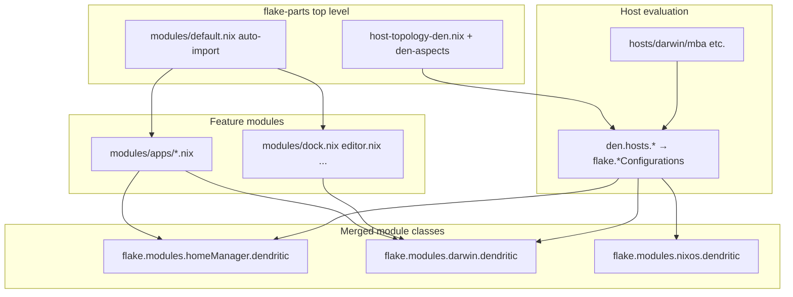

# Dendritic Nix: Patterns, Den, and Dendrix

This repository is built on the **Dendritic Pattern** for Nix configurations, with an incremental adoption of **[den](https://github.com/denful/den)** for host topology and aspects. **[Dendrix](https://dendrix.denful.dev/)** is the community layer for sharing reusable dendritic modules.

> For the full multi-file deep dive, start at [`docs/dendritic-nix/README.md`](./dendritic-nix/README.md).

> **Naming:** You may see _dendretix_, _dendretic_, or _dendric_ in older notes — the canonical names are **Dendritic** (the pattern), **Den** (the framework), and **Dendrix** (the community distribution).

## Overview

| Concept               | What it is                                                          | Primary link                                                  |
| --------------------- | ------------------------------------------------------------------- | ------------------------------------------------------------- |
| **Dendritic Pattern** | Organize Nix configs by _feature_, not by _platform_                | [mightyiam/dendritic](https://github.com/mightyiam/dendritic) |
| **Den**               | Aspect-oriented framework on top of the pattern                     | [denful/den](https://github.com/denful/den)                   |
| **Dendrix**           | Community-curated library of shareable dendritic modules (“layers”) | [dendrix.denful.dev](https://dendrix.denful.dev/)             |

Together they address the same problem: **cross-cutting features** (editors, browsers, theming, gaming, secrets) that need configuration in NixOS, nix-darwin, and Home Manager at once — without scattering related code across disconnected directories.

---

## The Dendritic Pattern

The Dendritic Pattern was introduced by [@mightyiam](https://github.com/mightyiam) and documented in the [NixOS Discourse thread](https://discourse.nixos.org/t/the-dendritic-pattern/61271). Official docs live at [github.com/mightyiam/dendritic](https://github.com/mightyiam/dendritic).

### Core idea

Instead of splitting configuration by _where it applies_:

```
hosts/laptop/nixos.nix
hosts/laptop/home-manager.nix
hosts/desktop/nixos.nix
...
```

…split by _what feature you are configuring_:

```
modules/apps/brave.nix      # Brave everywhere it is needed
modules/editor.nix          # Neovim / editor setup
modules/dock.nix            # macOS dock layout
den-aspects/styling.nix     # Global theming (Stylix)
```

Each file is a **flake-parts module** that can contribute to multiple lower-level module classes in one place.

### Rules

1. **Every `.nix` file is a top-level flake-parts module** — except entry points (`flake.nix`, `default.nix`) and private helpers (files prefixed with `_`).
2. **Each file implements one feature** across every configuration class that feature touches.
3. **Lower-level modules merge under shared names** (for example `flake.modules.homeManager.dendritic`) rather than proliferating dozens of individually named imports.
4. **File paths name features**, not hosts or platforms — files can be moved or split freely.

### How flake-parts fits

[flake-parts](https://flake.parts) applies the Nix module system to flake _outputs_. In the dendritic pattern, feature modules set options like:

```nix
flake.modules.homeManager.dendritic = { pkgs, lib, config, ... }: { ... };
flake.modules.darwin.dendritic   = { pkgs, lib, config, ... }: { ... };
flake.modules.nixos.dendritic    = { pkgs, lib, config, ... }: { ... };
```

Every contribution to `flake.modules.<class>.dendritic` **merges** into one deferred module. Host configs import the merged result once:

```nix
imports = [
  inputs.self.modules.darwin.dendritic
];
```

…and embedded Home Manager users do the same on the HM side:

```nix
home-manager.users."8amps".imports = [
  inputs.self.modules.homeManager.dendritic
];
```

### Auto-import in this repo

`modules/default.nix` discovers every eligible file under `modules/` and imports it as a flake-parts module:

```nix
isAutoImportable = path:
  let name = baseNameOf path;
  in lib.hasSuffix ".nix" name
  && name != "default.nix"
  && !lib.hasPrefix "_" name;
```

Adding `modules/apps/my-feature.nix` is enough — no manual import list to maintain.

### Example: dock + apps (cross-class feature)

`modules/dock.nix` declares a shared option and macOS defaults:

```nix
flake.modules.darwin.dendritic = { config, lib, ... }: {
  options.dendritic.dock.apps = lib.mkOption { ... };
  config.dendritic.dock.apps = lib.mkOrder 0 [ "/System/Applications/Apps.app" ... ];
  config.system.defaults.dock.persistent-apps = config.dendritic.dock.apps;
};
```

Individual app modules (`modules/apps/ghostty.nix`, `cursor.nix`, …) append their `.app` paths via `lib.mkOrder` at different priorities. The dock feature and each app stay in one file each, but compose at evaluation time.

### Benefits

- **Feature-local reasoning** — “Where is Brave configured?” → `modules/apps/brave.nix`.
- **No import-path archaeology** — modules share values through top-level `config`, not `specialArgs` pass-through chains.
- **Portable modules** — dendritic feature files can be copied or published (see Dendrix).
- **Shorter host files** — hosts wire identity and toggles; features live in `modules/`.

### Anti-patterns (from upstream)

- **Over-using `specialArgs`** to shuttle values between files — use top-level `config` instead.
- **One named lower-level module per feature** — prefer merging into shared names like `flake.modules.nixos.dendritic`.

Further reading:

- [Dendritic Pattern README](https://github.com/mightyiam/dendritic)
- [Doc-Steve: Dendritic Design with flake-parts](https://github.com/Doc-Steve/dendritic-design-with-flake-parts)
- [Flipping the Configuration Matrix](https://not-a-number.io/2025/refactoring-my-infrastructure-as-code-configurations/) (drupol)

---

## Den: Aspect-Oriented Dendritic Nix

[Den](https://github.com/denful/den) extends the dendritic idea from **file-level** to **function-level** configuration: aspects compose across hosts, users, and Nix classes, and `den.hosts.*` auto-generates flake outputs.

This repo uses Den for host topology (`modules/host-topology-den.nix`), shared styling via the `os` class (`den-aspects/styling.nix`), and optional aspect mirrors on feature modules. Most app/editor features still flow through `flake.modules.*.dendritic`.

**→ Full documentation: [docs/den.md](./den.md)** — context pipeline, entities, aspects, policies, custom classes, batteries, flake integration, repo layout, recipes, and debugging.

Upstream: [den.denful.dev](https://den.denful.dev)

---

## Dendrix: Community Dendritic Modules

[Dendrix](https://dendrix.denful.dev/) is a **community-driven distribution** of dendritic flake-parts modules — conceptually similar to [NUR](https://github.com/nix-community/NUR), but for multi-class feature modules rather than single packages.

Repository: [github.com/denful/dendrix](https://github.com/denful/dendrix) (formerly `vic/dendrix`; renamed to avoid confusion with [yunfachi/denix](https://github.com/yunfachi/denix)).

### What Dendrix provides

- **Layers** — opinionated, ready-to-enable feature bundles (gaming, desktop rices, dev shells, …)
- **Import trees** — structured ways to pull community aspects into your flake
- **Documentation** of community dendritic repos and which Nix classes each aspect targets

Dendrix modules are ordinary flake-parts / Den aspects meant to be **mixed in**, not a full replacement for your own config.

### Using Dendrix (typical workflow)

1. Add `dendrix` as a flake input.
2. Import a layer or aspect tree into your flake-parts evaluation.
3. Enable features via options or `den.aspects` includes — the layer contributes to all relevant classes automatically.

This repo does **not** currently depend on Dendrix; features are authored locally under `modules/` and `den-aspects/`. Dendrix is the path toward sharing or consuming community-maintained equivalents.

---

## This Repository’s Architecture

```
flake.nix                          # inputs, flake-parts entry
├── modules/default.nix            # auto-imports all feature modules
├── modules/
│   ├── apps/*.nix                 # per-app dendritic features
│   ├── dock.nix, editor.nix, …    # cross-cutting features
│   └── host-topology-den.nix      # Den hosts + host aspects
├── den-aspects/
│   └── styling.nix                # den.aspects.styling (+ HM mirror)
└── hosts/
    ├── darwin/mba/                # host identity, HM user block, toggles
    ├── nixos/*/                   # same pattern for Linux hosts
    └── hm/                        # standalone HM entry modules
```

### Configuration flow



### The `dendritic.*` option namespace

Feature modules declare options under `dendritic.*` (not `config.*` directly) to avoid collisions and to give hosts a stable toggle surface:

```nix
# In a host's home-manager.users block:
dendritic.apps.ghostty.enable = true;
dendritic.apps.cursor.enable = true;
dendritic.theme.variant = "dark";
```

Theme selection is centralized in `theme-selection.nix` and exposed via `dendritic.theme.*` options in `den-aspects/styling.nix`.

### Adding a new feature module

1. Create `modules/my-feature.nix` (or `modules/apps/my-feature.nix`).
2. Export to the appropriate merged classes:

   ```nix
   {
     flake.modules.homeManager.dendritic = { ... };
     flake.modules.darwin.dendritic = { ... };   # if needed
     flake.modules.nixos.dendritic = { ... };    # if needed
   }
   ```

3. Optionally add a Den aspect for future `den.homes.*` / cross-flake sharing:

   ```nix
   den.aspects.my-feature = {
     homeManager = myHmModule;
     darwin = myDarwinModule;
   };
   ```

4. Enable from a host user block with `dendritic.my-feature.enable = true` (after defining the option).

No changes to `flake.nix` or `modules/default.nix` are required — auto-import picks up the new file.

---

## Comparison: Traditional vs Dendritic vs Den

| Approach                           | Organization axis             | Multi-class features                    | Host scaling                     |
| ---------------------------------- | ----------------------------- | --------------------------------------- | -------------------------------- |
| **Traditional** (Misterio77-style) | By host, then by module type  | Split across HM/NixOS files             | Many host folders                |
| **Dendritic**                      | By feature                    | One file, multiple `flake.modules.*`    | Host files import merged modules |
| **Den**                            | By feature + aspect functions | Aspects with `includes`, custom classes | `den.hosts` generates outputs    |

---

## External Resources

- [The Dendritic Pattern (Discourse)](https://discourse.nixos.org/t/the-dendritic-pattern/61271)
- [mightyiam/dendritic](https://github.com/mightyiam/dendritic) — pattern docs + annotated example
- [denful/den](https://github.com/denful/den) — aspect-oriented framework
- [dendrix.denful.dev](https://dendrix.denful.dev/) — community layers
- [denful.dev](https://denful.dev/) — Vic’s dendritic ecosystem overview
- [flake.parts modules option](https://flake.parts/options/flake-parts-modules.html)
- [vic/import-tree](https://github.com/vic/import-tree) — filesystem auto-import helper
